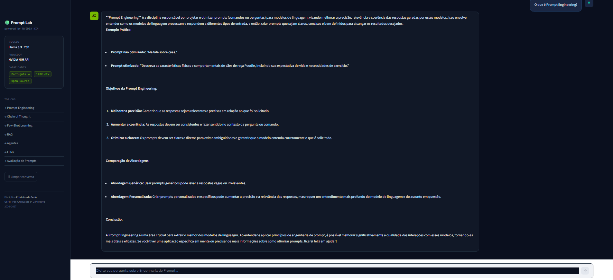

# 🤖 Chatbot com NVIDIA NIM + Streamlit na Oracle Cloud


> Projeto desenvolvido para a disciplina **Produtos de GenAI** da Pós-Graduação em Inteligência Artificial Generativa Aplicada – UFPR.

---

# 🚀 Aplicação Online

🌐 **Acesse o chatbot:**

**http://163.176.192.253:8501/**

---

# 📦 Repositório

GitHub:

**https://github.com/Pachanov/chatbot-nvidia**

---

# 📑 Índice

- Introdução
- Objetivo
- Demonstração
- Infraestrutura
- Modelo Utilizado
- Arquitetura
- Tecnologias
- Estrutura do Projeto
- Instalação
- Execução
- Implantação na Oracle Cloud
- Segurança
- Desafios Encontrados
- Lições Aprendidas
- Melhorias Futuras
- Autor

---

# 📖 Introdução

A Inteligência Artificial Generativa vem transformando a maneira como desenvolvemos aplicações inteligentes. Durante a disciplina **Produtos de GenAI**, foi proposto o desenvolvimento de um chatbot utilizando um modelo Open Source disponibilizado pela NVIDIA.

O objetivo principal foi criar uma aplicação web funcional utilizando **Python** e **Streamlit**, integrando um modelo de linguagem de grande porte (LLM) através da NVIDIA NIM API e publicando a aplicação em uma máquina virtual da Oracle Cloud Infrastructure (OCI).

O resultado é um chatbot totalmente funcional, acessível pela internet através de um endereço IP público.

---

# 🎯 Objetivo

Desenvolver um chatbot capaz de responder perguntas sobre Engenharia de Prompt utilizando um modelo Open Source da NVIDIA, permitindo acesso através de navegador web.

A atividade contempla:

- Desenvolvimento em Python;
- Interface web com Streamlit;
- Utilização de modelo Open Source;
- Publicação em nuvem;
- Gerenciamento seguro de credenciais.

---

# 📷 Demonstração

```
images/
├── tela1.png
├── tela2.png
├── demo.gif
```

Exemplo:

```markdown





```

---

# ☁️ Infraestrutura

| Item                | Configuração              |
| ------------------- | --------------------------- |
| Cloud               | Oracle Cloud Infrastructure |
| Sistema Operacional | Ubuntu 22.04 LTS            |
| Shape               | VM.Standard.E2.1.Micro      |
| CPU                 | 1 OCPU                      |
| Memória            | 1 GB RAM                    |
| Aplicação         | Streamlit                   |
| Porta               | 8501                        |
| IP Público         | 163.176.192.253             |

---

# 🤖 Modelo Utilizado

## Meta Llama 3.3 70B Instruct

Modelo disponibilizado através da plataforma **NVIDIA NIM API**.

### Justificativa

Foi escolhido por apresentar:

- Excelente desempenho em linguagem natural;
- Alto nível de precisão;
- Suporte ao idioma português;
- Modelo Open Source;
- Fácil integração via API.

### Características

- 70 bilhões de parâmetros
- Contexto estendido
- Baixa latência
- Compatível com OpenAI SDK
- Servido pela NVIDIA NIM

---

# 🏗 Arquitetura da Aplicação

```
                Usuário
                    │
                    ▼
        Interface Web (Streamlit)
                    │
                    ▼
             Aplicação Python
                    │
                    ▼
      NVIDIA NIM API (Llama 3.3 70B)
                    │
                    ▼
          Resposta do Modelo
                    │
                    ▼
                Usuário
```

---

# 💻 Tecnologias Utilizadas

- Python 3.11
- Streamlit
- NVIDIA NIM API
- Chatlas
- OpenAI SDK
- python-dotenv
- Git
- GitHub
- Ubuntu
- Oracle Cloud

---

# 📁 Estrutura do Projeto

```
chatbot-nvidia/
│
├── app.py
├── requirements.txt
├── README.md
├── .gitignore
├── .env (não versionado)
└── images/
```

---

# ⚙️ Instalação

Clone o repositório:

```bash
git clone https://github.com/Pachanov/chatbot-nvidia.git

cd chatbot-nvidia
```

Crie o ambiente virtual:

```bash
python -m venv .venv
```

Ative o ambiente:

### Linux

```bash
source .venv/bin/activate
```

### Windows

```powershell
.venv\Scripts\activate
```

Instale as dependências:

```bash
pip install -r requirements.txt
```

---

# 🔑 Configuração da API

Crie um arquivo chamado `.env`

```env
NVIDIA_API_KEY=sua_chave_aqui
```

---

# ▶️ Execução

Execute:

```bash
streamlit run app.py
```

Acesse:

```
http://localhost:8501
```

---

# ☁️ Implantação na Oracle Cloud

A aplicação foi publicada em uma máquina virtual Ubuntu hospedada na Oracle Cloud Infrastructure.

Passos realizados:

- Criação da VM
- Configuração do Ubuntu
- Instalação do Python
- Instalação das dependências
- Configuração da variável NVIDIA_API_KEY
- Liberação da porta 8501
- Configuração da Security List
- Execução do Streamlit

Execução:

```bash
nohup streamlit run app.py \
--server.port 8501 \
--server.address 0.0.0.0 &
```

---

# 🔒 Segurança

As credenciais da NVIDIA não são armazenadas no código.

Foi utilizado:

- arquivo `.env`
- python-dotenv

O arquivo `.env` está presente no `.gitignore`.

---

# ⚠️ Desafios Encontrados

Durante o desenvolvimento foram encontrados alguns desafios:

- Configuração da Oracle Cloud;
- Liberação da porta 8501;
- Configuração das Security Lists;
- Firewall do Ubuntu (UFW);
- Autenticação via chave SSH;
- Publicação do Streamlit para acesso externo.

---

# 📚 Lições Aprendidas

Este projeto proporcionou aprendizado em:

- Deploy de aplicações Python
- Oracle Cloud Infrastructure
- Streamlit
- Modelos Open Source
- NVIDIA NIM API
- Engenharia de Prompt
- Gerenciamento seguro de credenciais
- Git e GitHub

---

# 🚀 Melhorias Futuras

- Histórico persistente das conversas
- Autenticação de usuários
- Banco de dados
- Docker
- HTTPS
- Domínio personalizado
- Deploy automatizado via GitHub Actions

---

# 👨‍💻 Autor

**Victor Hugo Pachano Maurera**

Analista de Dados | Desenvolvedor Python | Pós-Graduando em Inteligência Artificial Generativa Aplicada (UFPR)

GitHub:

https://github.com/Pachanov

LinkedIn:

https://www.linkedin.com/in/victor-hugo-pachano-maurera/

---

# 📄 Licença

Este projeto foi desenvolvido para fins acadêmicos na disciplina **Produtos de GenAI**.

Licença MIT.

---

## ⭐ Se este projeto foi útil, deixe uma estrela no repositório!
